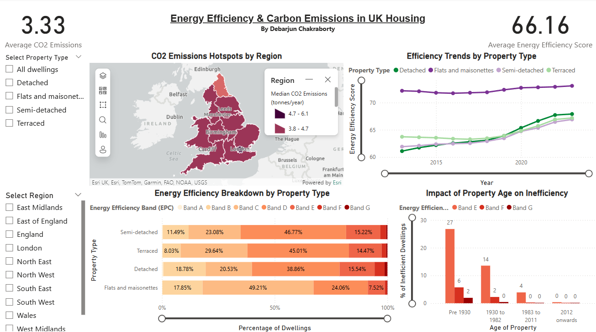

# UK Housing Energy Efficiency & Carbon Emissions Dashboard

## 📊 Project Overview
This project focuses on visualizing the energy efficiency and carbon dioxide (CO2) emission trends across housing in the United Kingdom. Developed as part of the **CSC8626 Data Visualization** module, this Power BI dashboard transforms complex housing data into actionable insights regarding property types, location hotspots, and historical energy trends.


*Figure: Overview of the Energy Efficiency Dashboard.*

## 🎯 Key Objectives & Insights

The dashboard was designed to address three specific analytical tasks:

### 1. Geospatial Analysis of CO2 Emissions
**Goal:** Assess the spread of carbon dioxide emissions across the UK based on property type.
* **Visualization:** An **ArcGIS map** was utilized to generate a heatmap of CO2 hotspots.
* **Design:** A gradient color scale was applied where lighter hues indicate lower emissions and darker hues represent critical emission zones.
* **Interaction:** Users can filter by specific property types (e.g., Detached, Terraced) to see how housing density impacts local emissions.

### 2. Temporal Efficiency Trends
**Goal:** Understand the evolution of energy efficiency scores over time (2015–2020).
* **Visualization:** A **Line Chart** displaying the median energy efficiency score over a 5-year period.
* **Design:** Distinct trend lines represent different property types, allowing for an instant comparison of which housing sectors are improving fastest.
* **Features:** Includes **Zoom Sliders** for granular time-frame analysis and region slicers to view specific geographical trends (e.g., North East vs. London).

### 3. Multidimensional Correlation Analysis
**Goal:** Identify correlations between Property Type, Location, and Energy Efficiency Bands (EPC).
* **Visualization:** A **100% Stacked Bar Chart** illustrates the part-to-whole relationship of EPC bands (A through G) across different housing categories.
* **Interaction:** By using the region slicer, users can investigate three-way correlations to see how energy ratings differ between regions like Wales and the East of England.

## 🛠️ Data Processing (ETL)
The raw dataset required significant transformation before visualization could begin. Using **Power Query**, the following steps were taken:
* **Unpivoting:** Columns were unpivoted to normalize the dataset structure.
* **Sanitization:** Unnecessary rows and artifacts were removed to ensure data quality.
* **Splitting:** Columns were split to isolate time-based attributes for temporal analysis.

## 🎨 Design & Accessibility Principles
Great care was taken to ensure the dashboard is not only functional but accessible and aesthetically consistent.

* **Color Accessibility:** A color-blind friendly palette (sourced from **ColorBrewer**) was used throughout the report to ensure universal readability. High contrast was maintained between adjacent colors.
* **Visual Hierarchy:** Major charts are centralized for immediate focus, while interactive elements (slicers) are positioned consistently on the sidebar for intuitive navigation.
* **Consistency:** A uniform design language was applied, using the **DIN** font family for all titles, labels, and legends to maintain a clean, professional look.
* **Clutter Reduction:** Decorative graphics and unnecessary gridlines were removed to adhere to the "data-ink ratio" principle, ensuring the data remains the star of the show.

## 🚀 How to Use
1.  **Clone the Repo:**
    ```bash
    git clone [https://github.com/DebarjunChakraborty/EnergyEfficiency-And-CarbonEmission-In-UK-Housing.git](https://github.com/DebarjunChakraborty/EnergyEfficiency-And-CarbonEmission-In-UK-Housing.git)
    ```
2.  **Open the Report:**
    * Open `CSC8626_Coursework_PowerBI.pbix` in **Microsoft Power BI Desktop**.
3.  **Interact:**
    * Use the **Region Slicer** on the left to filter all charts by geography.
    * Hover over the **Stacked Bar Chart** to see precise percentage breakdowns of EPC bands.
    * Adjust the **Zoom Slider** on the line chart to focus on specific years.

## 🧰 Tech Stack
* **Microsoft Power BI** (Dashboarding & Visualization)
* **Power Query** (ETL & Data Cleaning)
* **ArcGIS** (Geospatial Mapping)

---
*Created by Debarjun Chakraborty*
